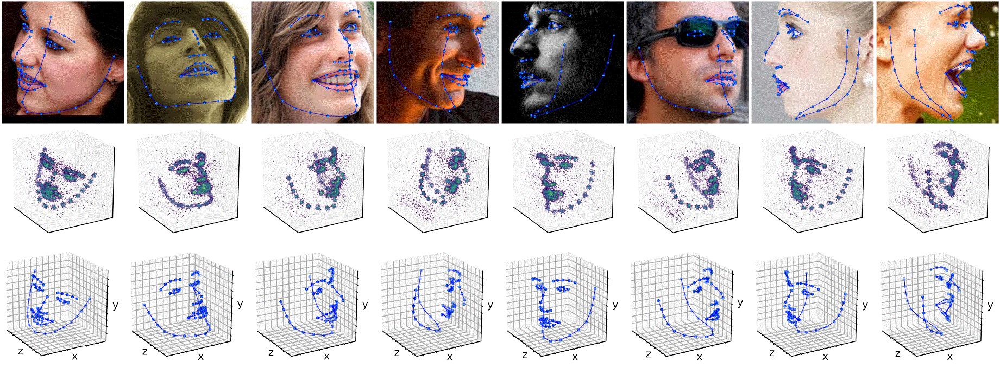

# Joint Voxel and Coordinate Regression for Accurate 3D Facial Landmark Localization

This repository includes the PyTorch code for training and evaluating the network described in [Joint Voxel and Coordinate Regression for Accurate 3D Facial Landmark Localization](https://arxiv.org/abs/1801.09242).

<p align='center'>
</img>
</p>

## Requirements

- python 2.7

### packages

- [PyTorch](https://www.pytorch.org)
- [NumPy](http://www.numpy.org)
- [Matplotlib](https://matplotlib.org)

## Usage

Clone the repository and install the dependencies mentioned above
```
git clone --recursive https://github.com/HongwenZhang/JVCR-3Dlandmark.git
cd JVCR-3Dlandmark
```
Then, you can run the demo code or train a model from stratch.

### Demo
1. Download the [pre-trained model](https://drive.google.com/drive/folders/1wT3efHjqUfTMHj8qAjkPn8m9qS614Lxu) (trained on [300W-LP](http://www.cbsr.ia.ac.cn/users/xiangyuzhu/projects/3DDFA/main.htm)) and put it into the `checkpoint` directory

2. Run the demo code

```
python run_demo.py --verbose
```

### Training

1. Prepare the training and evaluation datasets
- Download [300W-LP](http://www.cbsr.ia.ac.cn/users/xiangyuzhu/projects/3DDFA/main.htm) and [AFLW3000-3D](http://www.cbsr.ia.ac.cn/users/xiangyuzhu/projects/3DDFA/main.htm)
- Create soft links to the dataset directories
```
ln -s /path/to/your/300W_LP data/300wLP/images
ln -s /path/to/your/aflw2000 data/aflw2000/images
```
- Download `.json` annotation files from [here](https://drive.google.com/drive/folders/16cj4x1v1jbqikB4KS8ndnuP49coqwt1c) and put them into `data/300wLP` and `data/aflw2000` respectively
2. Run the training code
```
python train.py --gpus 0 -j 4
```

## Acknowledgment

The code is developed upon [PyTorch-Pose](https://github.com/bearpaw/pytorch-pose). Thanks to the original author.
